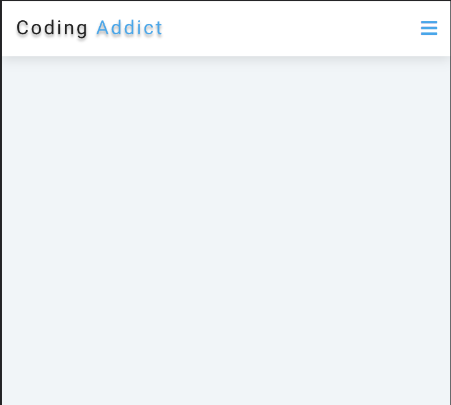

# NavBar

##
El proyecto consiste en desarrollar un navbar utilizando JavaScript, que permita colapsar la barra de navegación en pantallas pequeñas para mejorar su visibilidad. Se utilizarán técnicas de diseño responsivo para adaptar el navbar a diferentes tamaños de pantalla.

## Gif

Aquí se encuentra una imagen de ejemplo:

